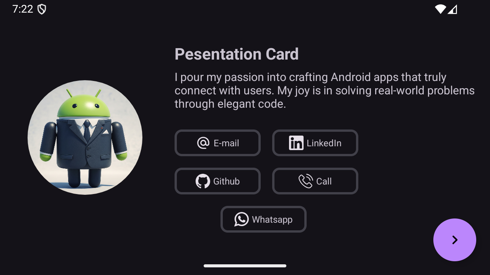
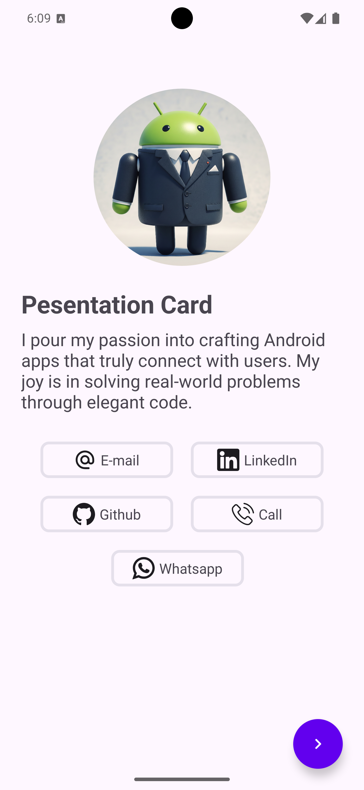
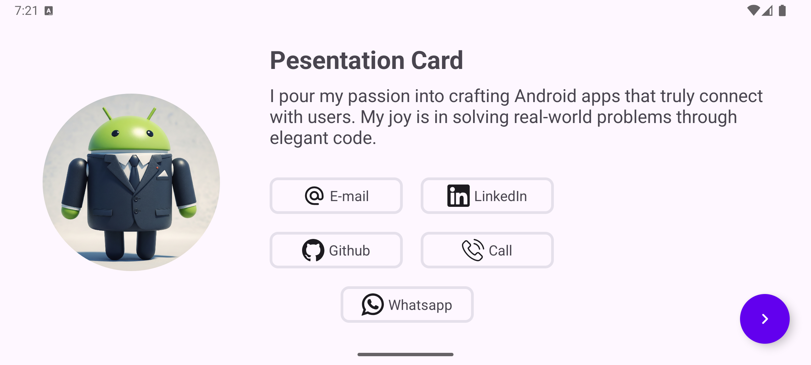

# Android Presentation Card App 📱



A comprehensive Android sample project designed to teach fundamental Android development concepts through building a practical presentation card application. This project serves as a hands-on learning experience for beginners to understand core Android components and modern development practices.

## 🎯 Project Overview

The **Presentation Card App** is an educational project that demonstrates essential Android development concepts by creating a digital business card application. Students will learn by building a complete app that showcases personal or professional information in an elegant, mobile-friendly format.

## 📚 Learning Objectives

This project teaches the following Android development concepts:

### Core Components
- **Activities & Lifecycle**: Understanding activity states and navigation
- **Layouts & Views**: XML layout design, ViewGroups, and UI components
- **Intents**: Activity navigation and data passing
- **Resources**: Strings, colors, dimensions, and drawable resources

### UI/UX Design
- **Material Design**: Implementing Google's design principles
- **Responsive Layouts**: Creating layouts that work across different screen sizes
- **Navigation Components**: Bottom navigation and activity transitions
- **Custom Styling**: Themes, styles, and custom drawable resources

### Data Management
- **JSON Parsing**: Reading and processing JSON data
- **RecyclerView**: Displaying lists with efficient scrolling
- **Adapters**: Connecting data to UI components
- **Resource Management**: Organizing and accessing app resources

## 🏗️ App Features

### ✨ Core Functionality
- **Profile Display**: Show personal/professional information with photo
- **Education Section**: Display educational background with RecyclerView
- **Social Networks**: Quick access to social media and contact information
- **Material Design**: Modern, clean UI following Material Design guidelines

### 🎨 UI Components Demonstrated
- Circular profile images with ShapeableImageView
- Card-based layouts for information display
- Custom backgrounds with border strokes
- Icon integration and tinting

### 📸 App Screenshots

<div align="center">
   
   
</div>

## 🚀 Getting Started

### Prerequisites
- Android Studio Arctic Meerkat or later
- Android SDK API level 24 or higher
- Basic understanding of Java
- Git for version control

### Installation
1. **Clone the repository**
   ```bash
   git clone https://github.com/yourusername/android-presentation-card.git
   cd android-presentation-card
   ```

2. **Open in Android Studio**
   - Launch Android Studio
   - Select "Open an existing Android Studio project"
   - Navigate to the cloned directory and select it

3. **Sync and Build**
   - Android Studio will automatically sync the project
   - Wait for the build to complete
   - Run the app on an emulator or physical device

---

**Happy Learning! 🚀** Start your Android development journey with this hands-on project and build your first professional presentation card app.
